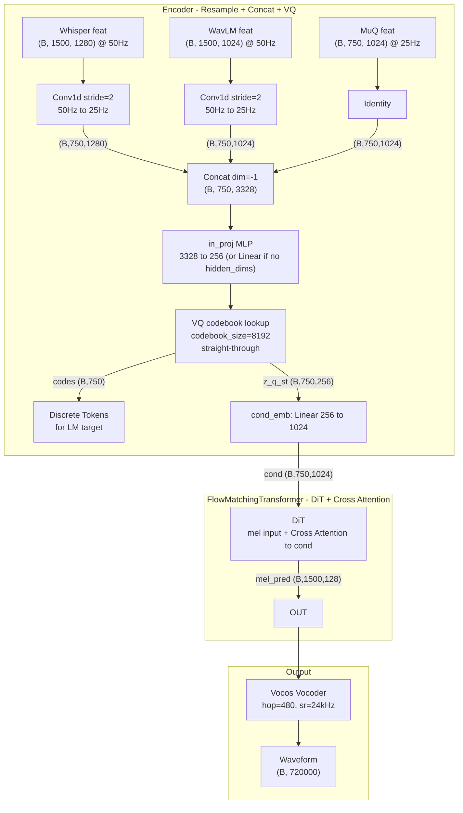

# Audio Reconstruction CFM Model

> 基于 SoulX-Singer 的 DiffLlama CFM 架构，构建音频重建 codec 模型。3 路特征 resample 到 25Hz 后 concat，经 in_proj 压缩到 256 维由单个 VQ 量化，256 维 codebook embedding 传入 FlowMatchingTransformer，经 cond_emb 投影后通过 **Cross Attention** 与 mel 交互（不再上采样），由 DiT 预测 mel 频谱。

## 架构总览



## 关键设计决策

- **先 Concat 再 VQ / RVQ**: 3 路特征各自 resample 到 25Hz 后，在特征维度 concat 成 (B, 750, 3328)，经 `in_proj` 压缩到 256 维（单层 VQ）或 `rvq_hidden_dim`（RVQ）。`in_proj` 可为单层 Linear 或多层 MLP：当配置 `in_proj_hidden_dims` 非空时（如 [1024, 512]）为 concat_dim → … → codebook_dim / rvq_hidden_dim 的 MLP（GELU + 可选 dropout），未配置时退化为单层 Linear。每帧单层 VQ 产生一个 token；RVQ 产生 n_layers 个 token（时间对齐后 concat 再 cond_proj 进 CFM）。
- **单层 VQ → CFM**: 256 维 codebook embedding（straight-through）直接作为 CFM 的 `cond_code`。**RVQ**：各层 16 维量化向量按时间对齐 concat 成 (B, T, n*16)，经 `cond_proj` 映射到 256 维再进 CFM，CFM 内部仍为 `cond_emb = nn.Linear(256, 1024)`。
- **Cross Attention 条件注入**：condition 不再上采样到 mel 帧率，而是保持 (B, T_cond, hidden_size)。DiT 在每个 block 内通过 Cross Attention 让 mel 序列（Q）attend 到 cond（K/V），T_cond 与 T_mel 可不同。推理时 `T_mel = T_cond * cond_scale_factor`。
- **VQ / RVQ 端到端训练**: 重建梯度通过 CFM → straight-through → in_proj 反传。单层 VQ 仅 commitment loss；RVQ 与 SoundStream / mucodec 对齐：**commitment loss**（encoder 拉向 codebook）+ **codebook loss**（codebook 拉向 encoder），可选 **L2 归一化** lookup（Improved VQGAN），权重通常为 0.25 * commitment + 1.0 * codebook。
- **无 Prompt 机制**: codec 重建不需要参考音频 prompt。CFG dropout 保留用于推理引导。
- **从 codes 推理**: 单层 VQ：`codes (B,T) → vq_codebook(codes)` → 256 维 → CFM。RVQ：`codes (B,T,n_layers) → rvq.lookup_codes(codes)` → concat 向量 → cond_proj → 256 维 → CFM。

## 数据流

### 特征提取位置（仅 mel.npz 时）

- **DataLoader 内（默认）**：`feature_extraction_on_gpu: false` 时，DataLoader worker 只读 mel.npz，由 `CodecFeatureExtractor` 在 CPU 上 mel→波形→Whisper/WavLM/MuQ，得到 whisper_feat / wavlm_feat / muq_feat 后与 mel 一起送入训练进程。
- **训练进程 GPU（推荐）**：`use_mel_extractor: true` 且 **feature_extraction_on_gpu: true** 时，DataLoader 只加载 mel 与 mel_mask；训练进程在 GPU 上对每个 batch 调用 `CodecFeatureExtractor.extract_batch(mel)` 得到 3 路特征，再送入模型。更快、无 worker CPU 瓶颈。

### 训练

```
whisper_feat (B,1500,1280) ──Conv1d s=2──┐
wavlm_feat  (B,1500,1024) ──Conv1d s=2──┤── concat ──→ (B,750,3328)
muq_feat    (B, 750,1024) ──identity────┘       │
                                          in_proj MLP / Linear
                                         (B, 750, 256)
                                               │
                                         VQ quantize
                                    ┌──────────┼──────────┐
                               codes (B,750)   │    commit_loss
                                         z_q_st (B,750,256)
                                               │
                              FlowMatchingTransformer.forward()
                                 cond_emb: 256 → 1024 (cond 保持 T_cond)
                                 forward_diffusion(mel, t)
                                 DiT(xt, t, cond)  # cross attention 条件注入
                                               │
                              flow_pred (B,1500,128) + flow_gt
                                               │
                                   L1 flow loss + commit_loss
```

### 推理（从 codes）

```
codes (B, 750) ──vq_codebook lookup──→ z_q (B, 750, 256)
                                            │
                          FlowMatchingTransformer.generate()
                             cond_emb: 256 → 1024 (cond 保持 T_cond)
                             Euler ODE: N steps, CFG
                             T_mel = T_cond * cond_scale_factor
                                            │
                                  mel (B, 1500, 128)
                                            │
                                    Vocos vocoder
                                            │
                                  waveform (B, 720000) @ 24kHz
```

### RVQ 训练与推理

- **训练**：`z_e = in_proj(concat_feat)` (B,T,rvq_hidden_dim) → ResidualVQ 逐层：proj_down → VQ(16 维) → straight-through → proj_up，残差传入下一层；各层 16 维量化向量按时间 concat → (B,T,128) → cond_proj → (B,T,256) → CFM。Loss：flow_loss + 0.25*commitment_loss + 1.0*codebook_loss。
- **推理**：`codes (B,T,8)` → `rvq.lookup_codes(codes)` → (B,T,128) → cond_proj → (B,T,256) → CFM.generate()。

RVQ 实现与 mucodec `descript_quantize3.py` 对齐：commitment + codebook loss、L2 归一化 lookup、残差逐层量化。

## 训练监控（TensorBoard）

- **train/codebook_util**：当前 batch 码本利用率（单层 VQ：唯一 code 数 / codebook_size；RVQ：各层利用率取平均），用于观察 codebook collapse。
- **vq/code_usage**：code 索引使用分布直方图（每若干 step 记录）。

## Flow Matching 核心公式

**插值路径**: $x_t = (1 - (1-\sigma)t) \cdot z + t \cdot x$ ，其中 $z \sim \mathcal{N}(0,I)$

**目标向量场**: $v_{gt} = x - (1-\sigma) \cdot z$

**Euler 积分** (推理): $x_{t+h} = x_t + v_\theta(x_t, t, \text{cond}) \cdot h$

**CFG**: $v = v_{cond} + s \cdot (v_{cond} - v_{uncond})$，配合 rescale 防止方差爆炸

**时间调度**: $t = 1 - \cos(t_{uniform} \cdot \pi / 2)$（余弦调度，前期更难）

## 文件结构

```
code/codec/
├── model.py              # AudioReconModel 主模型
├── flow_matching.py      # FlowMatchingTransformer（简化版，无 prompt/REPA/CTC）
├── llama.py              # DiffLlama（非因果 Llama + AdaptiveRMSNorm）
├── config.yaml           # 模型超参数配置
│
├── dataset/
│   ├── audio_webdataset.py   # CodecDataset, AudioWebDataset, init_dataset_and_dataloader
│   └── mel_to_features.py # 训练时 mel→波形→Whisper/WavLM/MuQ 在线特征（CodecFeatureExtractor）
├── whisper_feature.py    # Whisper 特征提取脚本
├── wavlm_feature.py      # WavLM 特征提取脚本
├── muq_feature.py        # MuQ 特征提取脚本
├── WavLM.py / modules.py # WavLM 模型依赖
├── whisper/              # Whisper 模型代码
├── MuQ/                  # MuQ 模型代码
└── oss_cli.py            # OSS 工具
```

## 模型关键方法

| 方法 | 用途 | 输入 | 输出 |
|------|------|------|------|
| `encode()` | 特征 → VQ codes | 3 路连续特征 | z_q_st (B,T,256), codes (B,T) 或 (B,T,n_layers), commit_loss [, codebook_loss 仅 RVQ] |
| `forward()` | 训练 | 3 路特征 + mel + mask | cfm_output + commit_loss + codes [+ codebook_loss 仅 RVQ] |
| `decode_from_codes()` | LM 推理 | codes (B,T) 或 (B,T,n_layers) | mel (B,1500,128) |
| `decode_from_features()` | 重建推理 | 3 路连续特征 | mel (B,1500,128) + codes |

## 超参数

| 参数 | 值 | 说明 |
|------|-----|------|
| codebook_size | 8192 | 单层 VQ 码本大小 |
| codebook_dim | 256 | 单层 VQ 码本向量维度（= in_proj 输出维度） |
| use_rvq | false | 是否使用 8 层 RVQ（覆盖单层 VQ） |
| rvq_codebook_sizes | 如 [1024]*8 | RVQ 每层码本大小（可变层数） |
| rvq_hidden_dim | 256 | RVQ 残差空间维度 |
| rvq_codebook_dim | 16 | RVQ 每层离散维度；concat 后 cond_proj 进 CFM |
| cfm_cond_dim | 256 | 送入 CFM 的条件维度（单层 256；RVQ 经 cond_proj 128→256） |
| in_proj_hidden_dims | 如 [1024, 512] 或 null | in_proj 隐藏层维度；null/[] 时为单层 Linear |
| in_proj_dropout | 0.1 | in_proj MLP 层间 dropout（仅多层时生效） |
| mel_dim | 128 | Mel 频谱维度 |
| hidden_size | 1024 | DiffLlama 隐藏维度 |
| num_layers | 22 | DiffLlama Transformer 层数 |
| num_heads | 16 | 注意力头数 |
| cond_scale_factor | 2 | 推理时 mel 帧数与 cond 帧数之比（T_mel = T_cond × cond_scale_factor） |
| use_flash_attn_3 | false | DiT 是否使用 Flash Attention 3（需 flash-attn≥2.7、Hopper GPU） |
| cfg_drop_prob | 0.2 | CFG dropout 概率 |
| time_scheduler | cos | 时间步余弦调度 |
| n_timesteps | 32 | 推理 Euler 步数 |
| sample_rate | 24000 | 音频采样率 |
| hop_size | 480 | Mel 帧步长（→ 50Hz） |
| commit_loss_weight | 0.25 | 训练时 commitment loss 权重 |
| codebook_loss_weight | 1.0 | 训练时 codebook loss 权重（仅 RVQ） |

## DiT  backbone（CosyVoice 风格）

FlowMatchingTransformer 使用 DiT（Diffusion Transformer）作为 flow 速度估计器：

- **InputEmbedding**：仅投影 mel `(B, T_mel, mel_dim)` 到 model dim，不再拼接 cond。
- **Cross Attention**：每个 DiTBlock 内含 Self-Attention + Cross-Attention + FFN。Cross-Attention 中 Q 来自 mel 隐藏状态，K/V 来自 cond，支持 `cond_mask` 屏蔽 padding。
- **Flash Attention 3（可选）**：设置 `use_flash_attn_3=True` 时，DiT 使用 `FlashAttn3Processor`，需 `flash-attn >= 2.7` 及 Hopper GPU（H100/H800）。padding 通过 `flash_attn_varlen_func` 正确处理。

## 依赖

- `torch >= 2.0`
- `transformers == 4.41.2`（与 SoulX-Singer 保持一致）
- `flash-attn >= 2.7`（可选，仅当 `use_flash_attn_3=True` 时需安装）
