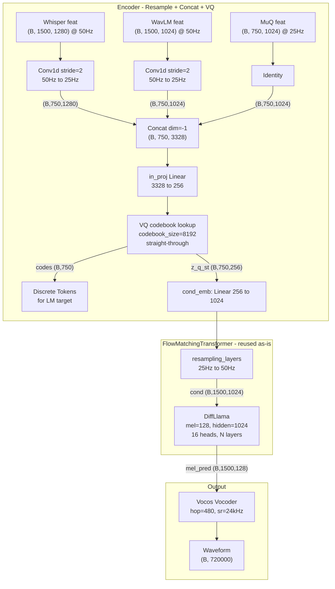

# Audio Reconstruction CFM Model

> 基于 SoulX-Singer 的 DiffLlama CFM 架构，构建音频重建 codec 模型。3 路特征 resample 到 25Hz 后 concat，经 in_proj 压缩到 256 维由单个 VQ 量化，256 维 codebook embedding 直接传入 FlowMatchingTransformer，由其内部完成投影和上采样，预测 mel 频谱。

## 架构总览



## 关键设计决策

- **先 Concat 再 VQ**: 3 路特征各自 resample 到 25Hz 后，在特征维度 concat 成 (B, 750, 3328)，经 `in_proj` 压缩到 256 维，由单个 VQ 量化。每帧只产生一个 token，最适合作为语言模型的生成目标
- **VQ codebook 输出直通 CFM**: VQ 的 256 维 codebook embedding (经 straight-through) 直接作为 `FlowMatchingTransformer` 的 `cond_code` 输入。CFM 内部的 `cond_emb = nn.Linear(256, 1024)` 完成投影，`resampling_layers` (ConvTranspose1d stride=2) 完成 25Hz→50Hz 上采样。**无需额外的 out_proj 或 cond_proj**
- **VQ 端到端训练**: 重建梯度通过 CFM → straight-through estimator → in_proj 反传，VQ codebook 同时受 commitment loss 和重建 loss 驱动
- **无 Prompt 机制**: codec 重建不需要参考音频 prompt。原 SoulX-Singer 的 prompt 逻辑已移除，CFG dropout 保留用于推理引导
- **从 codes 推理**: `codes → vq.codebook(codes)` 得到 256 维向量 → 传给 CFM 的 `reverse_diffusion`

## 数据流

### 训练

```
whisper_feat (B,1500,1280) ──Conv1d s=2──┐
wavlm_feat  (B,1500,1024) ──Conv1d s=2──┤── concat ──→ (B,750,3328)
muq_feat    (B, 750,1024) ──identity────┘       │
                                          in_proj Linear
                                         (B, 750, 256)
                                               │
                                         VQ quantize
                                    ┌──────────┼──────────┐
                               codes (B,750)   │    commit_loss
                                         z_q_st (B,750,256)
                                               │
                              FlowMatchingTransformer.forward()
                                 cond_emb: 256 → 1024
                                 upsample: 25Hz → 50Hz
                                 forward_diffusion(mel, t)
                                 DiffLlama(xt, t, cond)
                                               │
                              flow_pred (B,1500,128) + flow_gt
                                               │
                                   L1 flow loss + commit_loss
```

### 推理（从 codes）

```
codes (B, 750) ──vq_codebook lookup──→ z_q (B, 750, 256)
                                            │
                          FlowMatchingTransformer.generate()
                             cond_emb: 256 → 1024
                             upsample: 25Hz → 50Hz
                             Euler ODE: N steps, CFG
                                            │
                                  mel (B, 1500, 128)
                                            │
                                    Vocos vocoder
                                            │
                                  waveform (B, 720000) @ 24kHz
```

## Flow Matching 核心公式

**插值路径**: $x_t = (1 - (1-\sigma)t) \cdot z + t \cdot x$ ，其中 $z \sim \mathcal{N}(0,I)$

**目标向量场**: $v_{gt} = x - (1-\sigma) \cdot z$

**Euler 积分** (推理): $x_{t+h} = x_t + v_\theta(x_t, t, \text{cond}) \cdot h$

**CFG**: $v = v_{cond} + s \cdot (v_{cond} - v_{uncond})$，配合 rescale 防止方差爆炸

**时间调度**: $t = 1 - \cos(t_{uniform} \cdot \pi / 2)$（余弦调度，前期更难）

## 文件结构

```
code/codec/
├── model.py              # AudioReconModel 主模型
├── flow_matching.py      # FlowMatchingTransformer（简化版，无 prompt/REPA/CTC）
├── llama.py              # DiffLlama（非因果 Llama + AdaptiveRMSNorm）
├── config.yaml           # 模型超参数配置
│
├── whisper_feature.py    # Whisper 特征提取脚本
├── wavlm_feature.py      # WavLM 特征提取脚本
├── muq_feature.py        # MuQ 特征提取脚本
├── WavLM.py / modules.py # WavLM 模型依赖
├── whisper/              # Whisper 模型代码
├── MuQ/                  # MuQ 模型代码
└── oss_cli.py            # OSS 工具
```

## 模型关键方法

| 方法 | 用途 | 输入 | 输出 |
|------|------|------|------|
| `encode()` | 特征 → VQ codes | 3 路连续特征 | codes (B,750), z_q_st (B,750,256), commit_loss |
| `forward()` | 训练 | 3 路特征 + mel + mask | cfm_output + commit_loss + codes |
| `decode_from_codes()` | LM 推理 | codes (B,750) | mel (B,1500,128) |
| `decode_from_features()` | 重建推理 | 3 路连续特征 | mel (B,1500,128) + codes |

## 超参数

| 参数 | 值 | 说明 |
|------|-----|------|
| codebook_size | 8192 | VQ 码本大小 |
| codebook_dim | 256 | 码本向量维度（= in_proj 输出维度） |
| mel_dim | 128 | Mel 频谱维度 |
| hidden_size | 1024 | DiffLlama 隐藏维度 |
| num_layers | 22 | DiffLlama Transformer 层数 |
| num_heads | 16 | 注意力头数 |
| cond_scale_factor | 2 | 条件上采样倍率（25Hz → 50Hz） |
| cfg_drop_prob | 0.2 | CFG dropout 概率 |
| time_scheduler | cos | 时间步余弦调度 |
| n_timesteps | 32 | 推理 Euler 步数 |
| sample_rate | 24000 | 音频采样率 |
| hop_size | 480 | Mel 帧步长（→ 50Hz） |

## 依赖

- `torch >= 2.0`
- `transformers == 4.41.2`（与 SoulX-Singer 保持一致）
